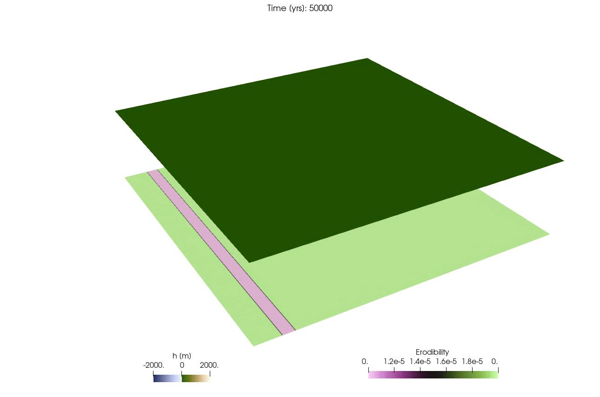

# FastScape.jl
[](https://github.com/boriskaus/FastScape.jl/actions/workflows/CI.yml)

Julia interface to [FastScape](https://fastscape.org) - a flexible and modular landscape evolution model developed at GFZ Potsdam.

This provides an interface to nearly all routines of the fortran version of the library. It also automatically downloads a [precompiled version](https://github.com/JuliaBinaryWrappers/Fastscapelib_jll.jl) of the library that works on Linux, Mac and Windows (provided you have julia >1.9).



The example above is from [DippingDyke.jl](./test/DippingDyke.jl), which is one of the example from FastScape.


### Installation
The package is currently not yet registered, which is why you have to install it with:
```julia
julia> ]
(@v1.10) pkg> add https://github.com/boriskaus/FastScape.jl
```
after this you can test it with:
```julia
(@v1.10) pkg> test FastScape.jl
```

### Usage
Various examples, copied from FastScape, are are provided in the [test](./test) directory.

